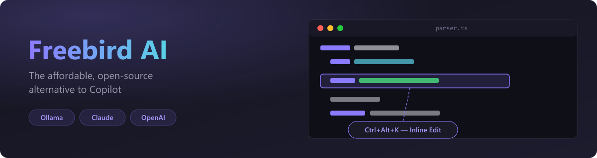
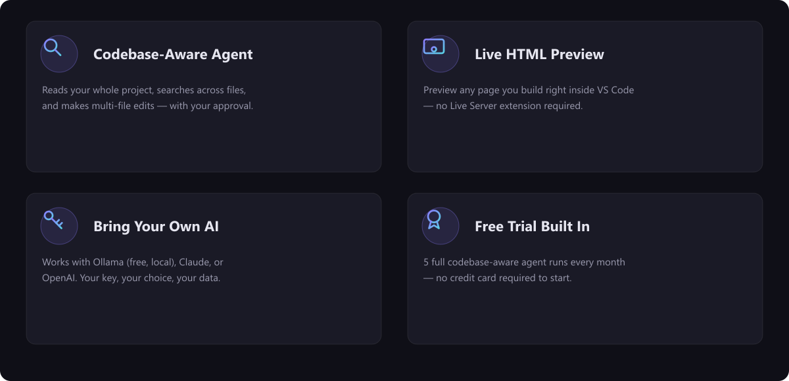

# Freebird AI — AI Coding Assistant for VS Code

**No setup. No throttling. 20 free AI edits/day.**

> AI coding assistant · Copilot alternative · Cursor alternative · multi-file AI edits · AI refactoring · codebase search · Gemini Flash · Ollama · BYOK · local AI · privacy-first

Install Freebird AI and start coding in seconds — no API keys, no throttling, no configuration. You get **20 free advanced AI edits per day** powered by Gemini Flash, plus unlimited local AI when you want full privacy.

**Copilot throttled? Cursor too expensive? GitHub limits hit?**
Freebird never blocks you — it picks up where other tools stop.

**[Start free — upgrade anytime for $6 USD/month →](https://buy.stripe.com/9B628t4WheMmeSMccZfAc03)**

---

## Why Freebird

| | Copilot | Cursor | Freebird Free | Freebird Pro |
|---|:---:|:---:|:---:|:---:|
| Price | $10/mo | $20/mo | **Free** | **$6/mo** |
| Setup required | No | Yes | **No** | No |
| Multi-file edits | Limited | ✅ | ✅ | ✅ |
| Local AI (Ollama) | ❌ | ❌ | ✅ | ✅ |
| BYOK | ❌ | ✅ | ❌ | ✅ |
| Throttling | ✅ | ✅ | Never | Never |

---

## See It in Action

### Multi-file agent edit with Approve / Reject
Ask Freebird to update your products page, add images to cards, or refactor across files — it shows a full diff and waits for your approval before changing anything.

### Agentic page editing across HTML and CSS
Freebird reads your existing code structure, understands the context, and makes targeted edits across files in one agent run.

---

## Free vs Pro

| Feature | Free | Pro ($6 USD/mo) |
|---|:---:|:---:|
| AI chat (unlimited questions) | ✅ | ✅ |
| Active file + `@` file context | ✅ | ✅ |
| `/` slash commands | ✅ | ✅ |
| Works instantly — no setup | ✅ | ✅ |
| Unlimited local Ollama (100% private) | ✅ | ✅ |
| **Advanced cloud edits (multi-file, inline, terminal, AI commit)** | 20/day | **Unlimited** |
| **Bring your own API keys — BYOK (Anthropic / OpenAI / DeepSeek / Qwen)** | — | ✅ |
| **Direct-to-LLM speed & total data privacy** | — | ✅ |
| **Project memory across sessions** | — | ✅ |

> **Pro tip:** Connect your DeepSeek API key — scores higher than GPT-4o on coding benchmarks at ~$0.20/million tokens. Thousands of unthrottled edits per month for a couple of dollars on top of your $6 plan.

---

## What Freebird Replaces

- **GitHub Copilot** — when you hit your monthly speed limit
- **Cursor Composer** — multi-file agent edits, without migrating from VS Code
- **Claude Code** — BYOK workflows at $6/month vs $20/month
- **Local coding agents** — Ollama integration built in, unlimited and private

---

## Features

### Works Immediately — No Setup Required
Install and start coding. Your first 20 advanced edits per day are powered by Gemini Flash — no API key, no Ollama, nothing to configure.

### 20 Free Advanced Edits Every Day
Multi-file edits, codebase search, inline edit, AI commits, terminal actions. Resets daily, no card required.

### Never Throttled — Always-On Fallback
Run out of cloud edits? Freebird falls back to local Ollama automatically. No Ollama? Falls back to Gemini cloud. You are never left with a broken tool.

### Multi-File Agent Edits with Approve / Reject
Freebird reads your codebase, fetches relevant files, and makes targeted edits across multiple paths. Every write shows an Approve / Reject card — nothing changes silently.

### Inline Edit — Cursor-style
Select any code, press `Ctrl+Alt+K`, type an instruction, and the selection is rewritten in place.

### Bring Your Own Keys — Unthrottled (Pro)
Plug in your own **Anthropic Claude**, **OpenAI**, **DeepSeek**, or **Qwen** API key. Direct-to-LLM speed, total data privacy, no middleman quotas.

### Smart Chat with File Context
Type `@filename` to inject any file into the conversation. Type `/` to see all available commands.

### Git Integration
Generate commit messages, push to remote, check git status — all from the chat panel.

### Project Memory (Pro)
Freebird saves notes about your project to `.freebird/memory.md` and loads them automatically. Use `/memory` to see what's saved and `/forget` to clear it.

---

## Pick the Right Model

| Model | Best for | Cost |
|---|---|---|
| **Gemini Flash (built-in)** | Default free tier — fast, no setup | Free (20/day) |
| **Ollama (local)** | Unlimited local AI — free, 100% private | Free |
| **DeepSeek V4-pro** | Advanced reasoning, coding, debugging | ~$0.14/M tokens |
| **Qwen 2.5 Coder** | High-accuracy coding | ~$0.16/M tokens |
| **GPT-4o** | Best all-rounder | ~$2.50/M tokens |
| **Claude Sonnet** | Complex refactoring & architecture | ~$3/M tokens |

All BYOK models require Pro. Gemini Flash and Ollama are always free.

---

## Getting Started

### Option 1 — Just Install (Recommended)
1. Install Freebird AI
2. Open chat (`Ctrl+Alt+O`)
3. Start coding — 20 free AI edits/day, no setup needed

### Option 2 — Ollama (Unlimited Free, Local)
1. Install [Ollama](https://ollama.com/download)
2. Run `ollama pull qwen2.5-coder` in a terminal
3. Run **Freebird: Configure AI Backend** → select **Ollama**

### Option 3 — Anthropic Claude (Pro, BYOK)
1. Get an API key at [console.anthropic.com](https://console.anthropic.com)
2. Run **Freebird: Configure AI Backend** → select **Anthropic Claude**

### Option 4 — OpenAI (Pro, BYOK)
1. Get an API key at [platform.openai.com](https://platform.openai.com)
2. Run **Freebird: Configure AI Backend** → select **OpenAI**

### Option 5 — DeepSeek (Pro, BYOK)
1. Get an API key at [platform.deepseek.com](https://platform.deepseek.com)
2. Run **Freebird: Configure AI Backend** → select **DeepSeek**

### Option 6 — Qwen 2.5 (Pro, BYOK)
1. Get an API key at [dashscope.console.aliyun.com](https://dashscope.console.aliyun.com)
2. Run **Freebird: Configure AI Backend** → select **Qwen 2.5**

---

## Commands

| Command | Shortcut | Description |
|---|---|---|
| Freebird: Open Chat | `Ctrl+Alt+O` | Open the AI chat panel |
| Freebird: Edit with AI | `Ctrl+Alt+K` | Inline rewrite selected code |
| Freebird: AI Commit | — | Generate a commit message |
| Freebird: Configure AI Backend | — | Switch between Gemini / Ollama / Claude / OpenAI / DeepSeek / Qwen |
| Freebird: Activate Pro License | — | Enter your Pro license key |

### Chat Commands

| Command | Description |
|---|---|
| `/commit` | Generate a commit message |
| `/push` | Push to remote |
| `/status` | Show git status |
| `/memory` | Show project memory (Pro) |
| `/forget` | Clear project memory (Pro) |
| `/clear` | Clear conversation history |
| `/help` | Show all commands |

---

## How the Agent Works

1. **Reads** your workspace file tree automatically
2. **Fetches** specific files it needs
3. **Searches** the codebase for symbols, patterns, or text
4. **Edits** files with targeted diffs — Approve / Reject before anything changes
5. **Creates** new files — preview shown before creation
6. **Runs** terminal commands — shown before execution
7. **Commits and pushes** — requires your explicit approval

Nothing is modified silently. You stay in full control.

---

## Settings

| Setting | Default | Description |
|---|---|---|
| `freebird.backend` | `cloud` | AI backend: `cloud`, `ollama`, `anthropic`, `openai`, `deepseek`, `qwen` |
| `freebird.apiKey` | *(empty)* | API key for BYOK backends |
| `freebird.model` | *(auto)* | Override the default model |
| `freebird.ollamaUrl` | `http://localhost:11434` | Ollama server URL |
| `freebird.licenseKey` | *(empty)* | Pro license key |
| `freebird.telemetry.enabled` | `true` | Anonymous usage analytics (no code/PII) |

---

## Privacy

- **Gemini Flash (free tier):** messages processed by Google's API. No code stored by Freebird.
- **Ollama:** all processing is local — no data leaves your machine.
- **Anthropic / OpenAI / DeepSeek / Qwen:** code sent to their APIs under your own account.
- **Freebird AI** (Ten Labs Pty. Limited) never collects or stores your code or conversation data.

---

## Support

**[support@ten-labs.com.au](mailto:support@ten-labs.com.au)** — payments, license activation, or anything else.

---

## Contributing

Open source (MIT). Issues and PRs welcome at the [GitHub repository](https://github.com/Adilaw12/freebird-vscode).

---

## License

MIT — Copyright © 2025 Ten Labs Pty. Limited
