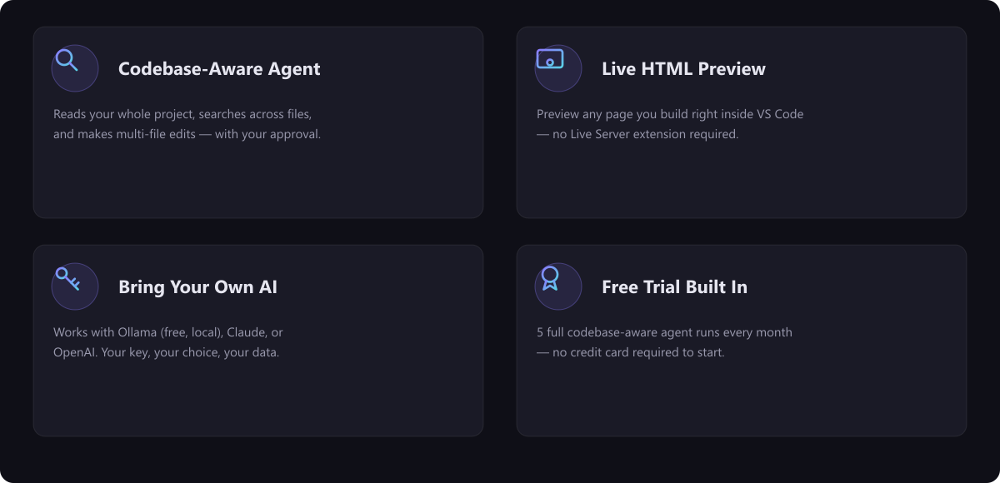

# Freebird AI — AI Coding Assistant for VS Code

**No setup. No throttling. 10 free AI edits/day.**

> AI coding assistant · Copilot alternative · Cursor alternative · multi-file AI edits · AI refactoring · codebase search · Claude Haiku · Gemini Flash · Kimi K3 · custom LLM providers (OpenRouter, Together, self-hosted) · prompt templates · Ollama · BYOK · local AI · privacy-first

**Run full codebase security audits, architecture mapping, and technical debt analysis with Agent mode** — try free for 7 days, no card needed. Pro is $6/month for unlimited multi-file editing, plus sharing a selection with a colleague without giving them your whole codebase — less than a third of Cursor's price, more capability out of the box. Team is $25/month for up to 5 seats.

Install Freebird AI and start coding in seconds — no API keys, no throttling, no configuration. You get **10 free advanced AI edits per day** powered by Gemini Flash Lite, plus free BYOK and unlimited local AI when you want full privacy.

**Copilot throttled? Cursor too expensive? GitHub limits hit?**
Freebird never blocks you — it picks up where other tools stop.

**[Upgrade to Pro — $6 USD/month →](https://buy.stripe.com/9B628t4WheMmeSMccZfAc03)** · or start a **free 7-day Pro trial** (no card needed) right from the chat panel

⭐ **If Freebird saves you time, a GitHub star helps others find it** — thank you!

> **📅 Heads up: the free daily cloud limit is changing on Monday, September 14.**
> To keep Freebird fast and reliable as usage grows, the free tier's daily cloud limit is moving from 20 to **10** advanced edits/day, effective **Monday, September 14**. Everything else on Free — unlimited chat, unlimited tab completions on Ollama/BYOK, project rules — is unchanged. If you're already relying on the higher limit day to day, **[Pro's $6/month unlocks unlimited cloud edits](https://buy.stripe.com/9B628t4WheMmeSMccZfAc03)** plus full Agent mode (multi-file edits, terminal commands, one-click checkpoints) — or try it free for 7 days, no card needed, right from the chat panel.

---

## Why Freebird

| | Copilot | Cursor | Freebird Free | Freebird Pro |
|---|:---:|:---:|:---:|:---:|
| Price | $10/mo | $20/mo | **Free** | **$6/mo** |
| Setup required | No | Yes | **No** | No |
| Multi-file agent edits + terminal | Limited | ✅ | ❌ | ✅ |
| Semantic codebase search (finds code by meaning) | Limited | ✅ | ❌ | ✅ |
| Checkpoint + one-click undo, every agent turn | ❌ | Limited | ❌ | ✅ |
| Local AI (Ollama) | ❌ | ❌ | ✅ | ✅ |
| BYOK (Claude, GPT-4o, DeepSeek, Qwen, Kimi K3, custom) | ❌ | ✅ | ✅ | ✅ |
| Unlimited cloud edits | ❌ throttled | ❌ throttled | ❌ 10/day soft cap | ✅ |
| Open source (MIT) | ❌ | ❌ | ✅ | ✅ |

---

## Safe by Design, Not Just "Trust the AI"

Letting an agent touch your codebase should come with proof, not a promise. Every Pro agent turn follows the same rule: nothing changes without your approval, and everything can be undone.

- **Approve every edit before it happens** — full diff shown, nothing writes silently.
- **Checkpoint on every turn** — one click restores every file the agent touched back to its exact state before that turn, even several turns later.
- **Project-aware, not file-blind** — semantic codebase search finds relevant code by *meaning* ("find the payment retry logic"), not just filename or exact-text matching like a plain grep. It reads your actual workspace tree and fetches the files it needs before proposing a change, and can check `git status` mid-turn when relevant.
- **Terminal commands shown before they run** — you see the command, not just the result.

Multi-file edits are only as trustworthy as the undo button behind them — Freebird's is one click, every time.

---

## See It in Action

### Multi-file agent edit with Approve / Reject (Pro)
Ask Freebird to update your products page, add images to cards, or refactor across files — it shows a full diff and waits for your approval before changing anything.

### Agentic page editing across HTML and CSS (Pro)
Freebird reads your existing code structure, understands the context, and makes targeted edits across files in one agent run.

### Codebase Cartographer, run on Freebird's own source (Pro)
We ran our own **Codebase Cartographer** prompt template against this repo — real output, not staged. It mapped the architecture, traced data flow end to end, and flagged a real, accurate gap in our own auth rollout, all cited to exact files. Below is the Mermaid.js dependency diagram it produced, rendered live in the chat panel.

---

## Free vs Pro

| Feature | Free | Pro ($6 USD/mo) |
|---|:---:|:---:|
| AI chat (unlimited questions) | ✅ | ✅ |
| Active file + `@` file context | ✅ | ✅ |
| `/` slash commands | ✅ | ✅ |
| Works instantly — no setup | ✅ | ✅ |
| Unlimited local Ollama (100% private) | ✅ | ✅ |
| **Bring your own API keys — BYOK (Anthropic / OpenAI / DeepSeek / Qwen / Kimi K3 / Custom Provider)**, direct-to-LLM speed & total privacy | ✅ | ✅ |
| AI tab completion (ghost text, as you type) | ✅ | ✅ |
| Project rules — `.freebird/rules.md`, your own conventions, always loaded | ✅ | ✅ |
| Inline edit (`Ctrl+Alt+K`) & AI commit, cloud-powered | 10/day | **Unlimited** |
| **Multi-file agent edits, terminal commands, checkpoints** | — | ✅ |
| **Project memory across sessions** | — | ✅ |
| **Share a selection with a colleague** — a link, not repo access | — | ✅ |
| Cloud model | Gemini Flash Lite | **Claude Haiku 4.5** |

Free tier responses are tagged with the model that answered right in the chat panel — you always know whether you're on the lite model or not, not left to guess.

---

## Team

$25/month for up to 5 seats ($5/seat — cheaper per-seat than an individual Pro subscription) — every Pro feature, one shared subscription. The purchaser becomes the owner and manages teammates from inside the extension with **Freebird: Manage Team Seats** (add, remove, list — no web dashboard). [Contact us](mailto:support@ten-labs.com.au) to set up a Team plan.

---

## Template Library

33 expert-crafted prompt templates on top of the 3 free ones — each built the same way (a role, a prioritized checklist, "cite the exact file and line," no theoretical padding) and covering real, recurring dev work: migration & modernization (framework migrations, dependency upgrades, state management, CSS), review & quality (senior-engineer-style review, DB migration safety, performance, dead code), compliance & accessibility (WCAG, license compliance, PII, i18n), onboarding & docs (PR descriptions, changelogs, API docs), infrastructure & DevOps (CI/CD, Dockerfiles, IaC), team & process, framework specialists (React, SQL, Python typing, GraphQL), release & ops, and testing deep-dives.

**Included free** if you're on Pro, Enterprise, or Team — no separate purchase. Otherwise it's a low-cost standalone subscription, cheaper than a full Pro upgrade, for anyone who wants the template library without everything else Pro includes. Browse the whole catalog (locked items are visible, not hidden) from the 📚 icon in the chat panel's top bar, the "Browse prompt templates" welcome-screen prompt, or **Freebird: Use Prompt Template** in the command palette. Already have a key? **Freebird: Activate Template Library License**.

---

## What Freebird Replaces

- **GitHub Copilot** — when you hit your monthly speed limit
- **Cursor Composer** — multi-file agent edits, without migrating from VS Code
- **Claude Code** — the same bring-your-own-key workflow, free, without leaving VS Code
- **Local coding agents** — Ollama integration built in, unlimited and private
- **Cloud-forbidden environments** — enterprise policies that ban cloud AI, NDA-bound freelance work — Pro's Agent mode runs on Ollama with zero calls ever leaving the machine

---

## Features

### Works Immediately — No Setup Required
Install and start coding. Your first 20 advanced edits per day are powered by Gemini Flash Lite — no API key, no Ollama, nothing to configure.

### 20 Free Advanced Edits Every Day
Unlimited chat, plus 20 cloud-powered inline edits and AI commits a day. Resets daily, no card required. Multi-file agent edits and terminal commands are Pro (see below).

### Hit Your Daily Cap? You've Got Options
If you've configured Ollama as your backend, Freebird falls back to it automatically when the cloud quota runs out. Otherwise you'll see a clear "free edits used up" prompt with a no-card 7-day Pro trial one click away — or switch to BYOK (free, unlimited) or Ollama (free, unlimited) anytime from **Freebird: Configure AI Backend**.

### Multi-File Agent Edits with Approve / Reject (Pro)
Freebird reads your codebase, fetches relevant files, and makes targeted edits across multiple paths. Every write shows an Approve / Reject card — nothing changes silently.

### Checkpoints — Undo an Entire Agent Turn (Pro)
Every Pro agent turn that creates, edits, copies, or downloads a file gets a "Checkpoint saved" card with a one-click Restore button, reverting every file that turn touched back to its state before the turn. Covers file changes; a turn that also ran a shell command or `git push` is clearly labeled as not revertible rather than pretending to cover it.

### Web Context — Read Any Page the Agent Needs (Pro)
The agent can fetch a webpage's readable content directly — documentation, an article, a URL you paste in — instead of only searching your own codebase. Requests to private/internal addresses (localhost, LAN ranges, cloud metadata endpoints) are blocked, and fetched content is explicitly marked as untrusted reference material before it ever reaches the model, so a malicious page can't pass itself off as an instruction.

### Inline Edit — Cursor-style
Select any code, press `Ctrl+Alt+K`, type an instruction, and the selection is rewritten in place.

### AI Tab Completion
Ghost-text suggestions as you type, on every tier — accept with `Tab`. Runs through whatever backend you've configured, same as the rest of Freebird: instant and unlimited on Ollama, otherwise it's a cloud-powered edit like inline edit and AI commit.

### Bring Your Own Keys — Unthrottled, free
Plug in your own **Anthropic Claude**, **OpenAI**, **DeepSeek**, **Qwen**, or **Kimi K3** API key — or point Freebird at any OpenAI-compatible **Custom Provider** (OpenRouter, Together, self-hosted, etc.). Direct-to-LLM speed, total data privacy, no middleman quotas — free for everyone, since the calls never touch Freebird's servers. DeepSeek in particular is worth a look even if cost isn't a concern: it scores higher than GPT-4o on coding benchmarks and runs about $0.20/million tokens.

### Full Agent Mode With Zero Cloud Calls (Pro)
Agent mode isn't locked to Freebird's cloud — it routes through whatever backend you've configured, same as everything else. Set the backend to **Ollama** and get the full Pro feature set (multi-file edits, terminal commands, checkpoints, project memory) with every request staying on your machine. Built for teams whose policy forbids cloud AI, or freelancers working under an NDA that does the same — the model runs locally, so there's nothing to disclose.

### Smart Chat with File Context
Type `@filename` to inject any file into the conversation. Type `/` to see all available commands.

### Semantic Codebase Search (Pro)
Two ways the agent finds code: `search_code` for exact/keyword matches (like grep — good when you know the literal text), and semantic search for finding code by *meaning* — ask for "the payment retry logic" and it surfaces relevant code even if nothing is named "payment." Run **Freebird: Build Codebase Index** once per project to enable it; the agent picks whichever search fits your question automatically.

### Git Integration
Generate commit messages, push to remote, and check git status from the chat panel — and the agent can call `git status` itself mid-turn when it's relevant to the change it's making, not just on request.

### Project Rules
Write your own conventions to `.freebird/rules.md` — style preferences, things to always or never do, whatever you'd otherwise repeat in every prompt. Freebird loads it automatically into chat and Agent mode alike and follows it over its own defaults. Yours to write; Freebird only ever reads it. Use `/rules` to see what's loaded. Free and Pro both.

### Project Memory (Pro)
Freebird saves notes about your project to `.freebird/memory.md` and loads them automatically. Use `/memory` to see what's saved and `/forget` to clear it. The difference from rules.md: this file is Freebird's own scratch notes, written opportunistically during Agent turns — rules.md is yours, written on purpose, and always takes precedence.

### Share a Selection (Pro)
Select code, right-click → **Freebird: Share Selection** (or run it from the command palette), and get a link back — copied to your clipboard automatically. Whoever opens it sees just that selection in a plain read-only page, nothing else about your project: no repo access, no invite, no Freebird install required on their end. Links expire after 14 days. This is what "team collaboration" means here — not shared repo access, a scoped way to show a colleague one thing.

### Related Locations — Lightweight Next-Edit Awareness (Pro)
After an Agent-mode edit, Freebird flags specific places elsewhere in your codebase that likely need the same change but weren't touched — another call site, a test asserting the old behavior, a doc describing it — as a short, dedicated card, not buried in prose. This is not Cursor's trained next-edit-prediction model; it's the agent using the same search tools it already has to double-check its own blast radius, and it only speaks up when it actually finds something.

### Run Specialized Agents on Your Codebase
Map architecture, audit security, generate tests — all multi-file, all reversible. Or go freeform with BYOK + our managed backends.

Run **Freebird: Use Prompt Template** to start from a ready-made prompt — populates the chat input for you to edit before sending, rather than firing immediately. These are deliberately thorough (each is instructed to read broadly across your codebase — up to 15 tool calls in a turn) rather than fast, so expect a couple of minutes on a real project, not a quick chat-style reply. Three are free forever; 33 more (migrations, deeper reviews, compliance/accessibility, release automation, framework specialists, and more) are the [Template Library](#template-library) — included with Pro/Enterprise/Team, or its own standalone subscription.

**Codebase Cartographer** — architecture overview, key abstractions and how data flows end to end, conventions worth knowing, real technical debt (not stylistic nitpicks), and a Mermaid.js dependency diagram. Pairs especially well with a large-context model like Kimi K3 on an unfamiliar codebase.

**Security Auditor** — cites the exact file and line for every finding, the concrete failure scenario (specific input/conditions that trigger it, not "this could be a vulnerability"), severity based on real exploitability, and a fix that doesn't change intended behavior. Fewer, real findings — no theoretical padding.

**Multi-File Test Engineer** — reads your existing test suite first to match its actual conventions, then prioritizes business logic with real consequences, easy-to-miss edge cases, and regression coverage for anything that's been a source of bugs before. Runs the tests it writes and fixes failures before finishing.

---

## Pick the Right Model

| Model | Best for | Cost |
|---|---|---|
| **Gemini Flash Lite (built-in)** | Default free tier — fast, no setup | Free (10/day) |
| **Claude Haiku 4.5 (built-in, Pro)** | Default Pro cloud model — noticeably stronger than the free tier's | Included in Pro |
| **Ollama (local)** | Unlimited local AI — free, 100% private | Free |
| **DeepSeek V4-pro** | Advanced reasoning, coding, debugging | ~$0.14/M tokens |
| **Qwen 2.5 Coder** | High-accuracy coding | ~$0.16/M tokens |
| **Kimi K3** | Frontier-scale reasoning, huge codebases (1M token context) | See [platform.moonshot.ai](https://platform.moonshot.ai) |
| **GPT-4o** | Best all-rounder | ~$2.50/M tokens |
| **Claude Sonnet** | Complex refactoring & architecture | ~$3/M tokens |
| **Custom Provider** | Any OpenAI-compatible API — OpenRouter, Together, self-hosted, etc. | Depends on provider |

BYOK models are free for everyone (bring your own API key/cost). Gemini Flash Lite and Ollama are also always free. Pro adds Agent mode (multi-file edits, terminal, checkpoints) and unlimited cloud edits on Claude Haiku 4.5 — automatically falls back to Gemini if Anthropic is ever unreachable, so Pro never hard-fails.

### Using Freebird From Hong Kong or Mainland China

Google and Anthropic each independently restrict API access from Hong Kong and mainland China as their own policy — this isn't something Freebird can route around, and in Hong Kong's case it isn't related to local network censorship either (Hong Kong isn't behind mainland China's firewall; Google and Anthropic simply don't serve API traffic from the region). In practice: the free tier's default Gemini backend and Pro's default Claude backend may not work reliably, or at all, from either location, even with a valid subscription.

If you're in Hong Kong or mainland China, skip the cloud tier and use BYOK with **DeepSeek** or **Qwen** instead — both are Chinese-origin providers with no regional restriction, and DeepSeek in particular is priced competitively for what it offers. **Ollama** (fully local, nothing ever leaves your machine) also works everywhere, regardless of any provider's regional policy.

---

## Getting Started

### Option 1 — Just Install (Recommended)
1. Install Freebird AI
2. Open chat (`Ctrl+Alt+O`)
3. Start coding — 10 free AI edits/day, no setup needed

### Option 2 — Ollama (Unlimited Free, Local)
1. Install [Ollama](https://ollama.com/download)
2. Run `ollama pull qwen2.5-coder` in a terminal
3. Run **Freebird: Configure AI Backend** → select **Ollama**

### Option 3 — Anthropic Claude (BYOK, free)
1. Get an API key at [console.anthropic.com](https://console.anthropic.com)
2. Run **Freebird: Configure AI Backend** → select **Anthropic Claude**

### Option 4 — OpenAI (BYOK, free)
1. Get an API key at [platform.openai.com](https://platform.openai.com)
2. Run **Freebird: Configure AI Backend** → select **OpenAI**

### Option 5 — DeepSeek (BYOK, free)
1. Get an API key at [platform.deepseek.com](https://platform.deepseek.com)
2. Run **Freebird: Configure AI Backend** → select **DeepSeek**

### Option 6 — Qwen 2.5 (BYOK, free)
1. Get an API key at [dashscope.console.aliyun.com](https://dashscope.console.aliyun.com)
2. Run **Freebird: Configure AI Backend** → select **Qwen 2.5**

### Option 7 — Kimi K3 (BYOK, free)
1. Get an API key at [platform.moonshot.ai](https://platform.moonshot.ai)
2. Run **Freebird: Configure AI Backend** → select **Kimi K3**
3. Defaults to `kimi-k3` (2.8T frontier, 1M token context) — set `freebird.model` to `kimi-k2` for the previous generation instead

### Option 8 — Custom Provider (BYOK, free)
Point Freebird at any OpenAI-compatible API — OpenRouter, Together, Groq, Fireworks, a self-hosted vLLM/LM Studio server, or anything else that speaks the `/chat/completions` format.
1. Run **Freebird: Configure AI Backend** → select **Custom Provider**
2. Enter the provider's base URL (e.g. `https://openrouter.ai/api/v1`) and the exact model id it expects (e.g. `openai/gpt-4o`)
3. Enter your API key when prompted

---

## Commands

| Command | Shortcut | Description |
|---|---|---|
| Freebird: Open Chat | `Ctrl+Alt+O` | Open the AI chat panel |
| Freebird: Edit with AI | `Ctrl+Alt+K` | Inline rewrite selected code |
| Freebird: AI Commit | — | Generate a commit message |
| Freebird: Configure AI Backend | — | Switch between Gemini / Ollama / Claude / OpenAI / DeepSeek / Qwen |
| Freebird: Activate Pro License | — | Enter your Pro license key |
| Freebird: Share Selection | — | Share the selected code as a read-only link (Pro) |
| Freebird: Use Prompt Template | — | Browse the free + paid Template Library |
| Freebird: Activate Template Library License | — | Enter a standalone Template Library license key |

### Chat Commands

| Command | Description |
|---|---|
| `/commit` | Generate a commit message |
| `/push` | Push to remote |
| `/status` | Show git status |
| `/rules` | Show your project conventions from `.freebird/rules.md` |
| `/memory` | Show project memory (Pro) |
| `/forget` | Clear project memory (Pro) |
| `/clear` | Clear conversation history |
| `/help` | Show all commands |

---

## How the Agent Works (Pro)

1. **Reads** your workspace file tree automatically
2. **Fetches** specific files it needs
3. **Searches** the codebase — exact/keyword matches via `search_code`, or by *meaning* via semantic search, whichever fits the question
4. **Edits** files with targeted diffs — Approve / Reject before anything changes
5. **Creates** new files — preview shown before creation
6. **Runs** terminal commands — shown before execution
7. **Commits and pushes** — requires your explicit approval
8. **Checkpoints** every turn that touched files — one click undoes the whole thing, anytime

Nothing is modified silently. You stay in full control.

---

## Settings

| Setting | Default | Description |
|---|---|---|
| `freebird.backend` | `cloud` | AI backend: `cloud`, `ollama`, `anthropic`, `openai`, `deepseek`, `qwen` |
| `freebird.apiKey` | *(empty)* | API key for BYOK backends |
| `freebird.model` | *(auto)* | Override the default model |
| `freebird.ollamaUrl` | `http://localhost:11434` | Ollama server URL |
| `freebird.licenseKey` | *(empty)* | Pro license key |
| `freebird.templateLicenseKey` | *(empty)* | Standalone Template Library license key (not needed if you're on Pro/Enterprise/Team) |
| `freebird.telemetry.enabled` | `true` | Anonymous usage analytics (no code/PII) |

---

## Privacy

- **Gemini Flash Lite (free tier):** messages processed by Google's API under Freebird's own account. No code stored by Freebird.
- **Claude Haiku 4.5 (Pro/Enterprise/trial cloud edits):** messages processed by Anthropic's API under Freebird's own account, not yours — same trust model as the free tier's Gemini calls, just a different upstream provider. Automatically falls back to Gemini if Anthropic is unreachable.
- **Ollama:** all processing is local — no data leaves your machine. This applies to Agent mode too (Pro) — set the backend to Ollama and multi-file edits, terminal commands, and checkpoints all run without a single cloud call, which is what makes Freebird usable under a corporate no-cloud-AI policy or an NDA that forbids sending code off-machine.
- **Anthropic / OpenAI / DeepSeek / Qwen / Kimi K3 / Custom Provider:** code sent to that provider's API under your own account.
- **Freebird AI** (Ten Labs Pty. Limited) never collects or stores your code or conversation data — the one exception is **Share Selection**: a selection you explicitly choose to share is stored for 14 days (then auto-deleted) so the link keeps working, since the whole point is that the recipient doesn't need Freebird or repo access to view it.
- **Web fetches (`fetch_url`):** private/internal addresses (localhost, LAN ranges, cloud metadata endpoints) are blocked, and fetched page content is explicitly marked as untrusted before it reaches the model.
- **Checkpoint restores** can't write outside your workspace folder, even if a checkpoint record were somehow corrupted.

---

## Support

**[support@ten-labs.com.au](mailto:support@ten-labs.com.au)** — payments, license activation, or anything else.

---

## Contributing

Open source (MIT). Issues and PRs welcome at the [GitHub repository](https://github.com/Adilaw12/freebird-vscode).

---

## License

MIT — Copyright © 2025 Ten Labs Pty. Limited
